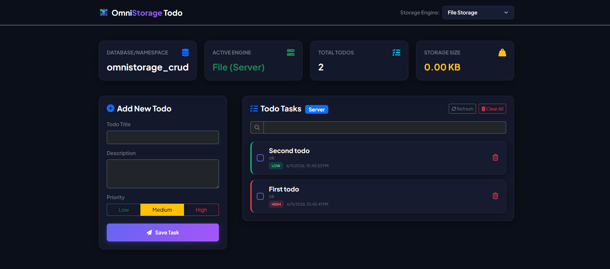

<div align="center">
  
</div>

# OmniStorage Todo CRUD Dashboard

A Node.js web application implementing a Todo CRUD using `@x-labs-myid/omnistorage`. This application showcases dynamic switching of storage engines, live storage usage statistics, and a real-time operation logging viewer using Bootstrap 5 and FontAwesome.

## Key Features

- **Dynamic Storage Switcher**: Choose from different backends like `memory` (Cacheable), `file` (filesystem storage), and `sqlite-server` (local SQLite database) directly from a select dropdown.
- **Todo CRUD**: Create, read, update status (completed/active), search, and delete todo tasks.
- **Live Stats Panel**: Real-time updates showing current database name, active engine, total tasks, and storage size.
- **Activity Logs**: View operational logs (`insert`, `update`, `destroy`, `truncate`) directly generated by OmniStorage.

## Tech Stack

- **Backend**: Node.js, Express.js
- **Storage Layer**: `@x-labs-myid/omnistorage`
- **Frontend**: Vanilla JavaScript, Bootstrap 5 (Styling), FontAwesome 6 (Icons)

---

## Getting Started

### Prerequisites

Ensure you have **Node.js** (v18+) and **npm** installed on your system.

### Installation

1. Install all dependencies:
   ```bash
   npm install
   ```

### Running the Application

1. Start the Express server:

   ```bash
   node server.js
   ```

2. Open your web browser and navigate to:
   ```text
   http://localhost:3000
   ```

### Storage Engines Behavior

- **Memory**: Stores items in-memory. They will be reset when the server restarts.
- **File**: Stores items inside a JSON file named after the database in your workspace (e.g. `<dbname>.json`). Data is persistent.
- **SQLite Server**: Stores items in a local SQLite database file in the workspace. Data is persistent.

### Vite Configuration

This sample uses a normal Vite configuration. OmniStorage no longer requires aliases for Node-only modules such as `fs`, `fs/promises`, `path`, `better-sqlite3`, `bindings`, or `util` when building the browser client.

```js
import { defineConfig } from "vite";

export default defineConfig({
  server: {
    proxy: {
      "/api": {
        target: "http://localhost:3001",
        changeOrigin: true,
      },
    },
  },
});
```
